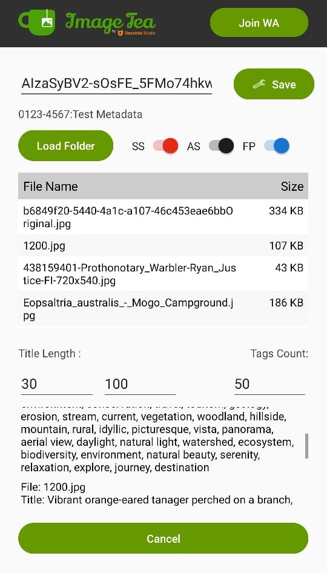

# Image-Tea

بِسْمِ اللهِ الرَّحْمٰنِ الرَّحِيْمِ

Assalamu'alaikum Warahmatullahi Wabarakatuh 👋

Halo Sobat! Selamat datang di **Image-Tea**!

Image-Tea adalah aplikasi untuk menggenerate metadata gambar. Mungil, gesit, dan super cepat, tapi jangan salah - kemampuannya luar biasa dahsyat! Aplikasi ini dirancang khusus untuk kamu yang butuh generate metadata gambar tanpa ribet. Ringan di perangkat, berat di fitur! 💪

[](https://github.com/mudrikam/Image-Tea/releases)
[](https://github.com/mudrikam/Image-Tea/stargazers)
[](https://github.com/mudrikam/Image-Tea/issues)
[](https://github.com/mudrikam/Image-Tea/releases)
[](https://github.com/mudrikam/Image-Tea)
[](https://github.com/mudrikam/Image-Tea)


## Fitur Utama

- 🤖 **Generate Metadata Otomatis** - Ciptakan judul, deskripsi, dan tag untuk gambarmu dengan bantuan Gemini AI
- 📊 **Ekspor ke CSV** - Simpan metadata ke file CSV yang siap upload ke platform microstock favorit
- ✏️ **Kustomisasi Fleksibel** - Atur panjang judul dan jumlah tag sesuai kebutuhan platform targetmu
- 🖼️ **Dukungan Format Luas** - Kompatibel dengan format gambar umum seperti JPG, JPEG, PNG, dan lainnya
- ⚡ **Ringan & Cepat** - Proses banyak gambar dalam waktu singkat tanpa memberatkan perangkat

## Instalasi

```bash
# Download aplikasi dari release terbaru
# Ekstrak, install dan jalankan
```

## Cara Penggunaan

1. **Buka aplikasi Image-Tea**
2. **Masukkan API Key Gemini** - Kamu bisa mendapatkannya dengan mudah (cari tutorial di Google)
3. **Simpan pengaturan API** - Klik save dan kamu siap meluncur!
4. **Load folder gambarmu** - Pilih lokasi gambar yang mau dibuatkan metadata (saat ini untuk 1 folder, belum support 1 gambar)
5. **Simpan hasil CSV** - Dapatkan metadata siap pakai dengan opsi:
    - **SS**: untuk Shutterstock
    - **AS**: untuk Adobe Stock
    - **FP**: untuk Freepik
    - Pilih mau simpan semua platform atau hanya satu saja sesuai kebutuhanmu

Gampang kan? Dalam hitungan menit, gambar-gambarmu sudah punya metadata keren siap upload! 🚀

## Screenshot



## Grup Komunitas

[](https://chat.whatsapp.com/CMQvDxpCfP647kBBA6dRn3)

Gabung grup WhatsApp kami untuk mendapatkan update terbaru, berbagi tips, dan saling membantu sesama pengguna Image-Tea!